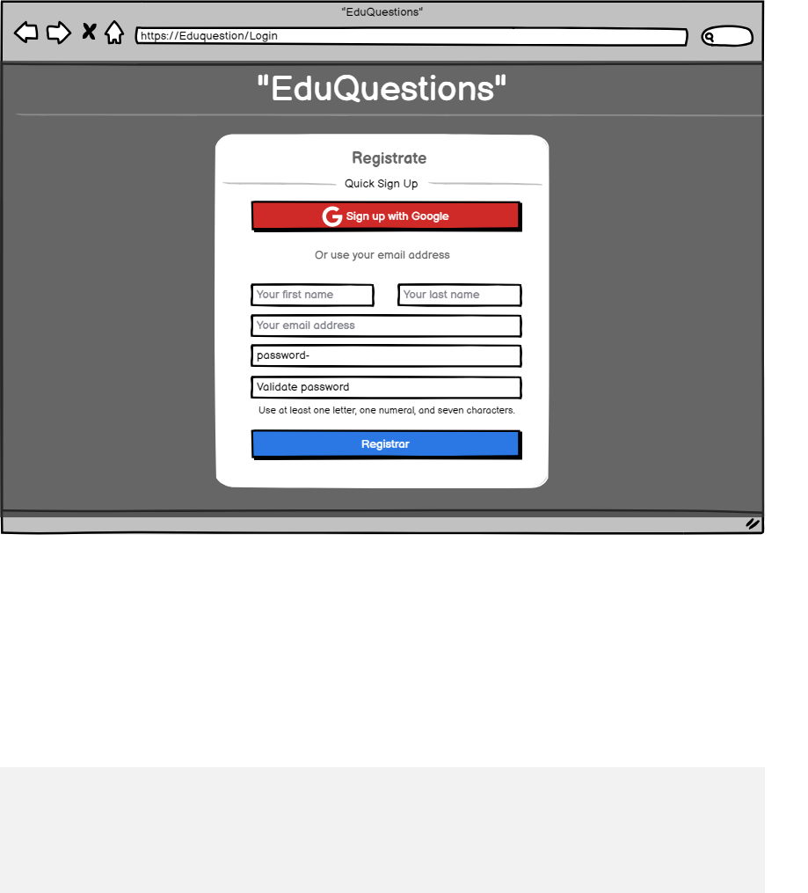

# Historia: Publicacion de Ingreso.

- Yo como: Usuario Estudiante
- Quiero: ver un botón o enlace de "Registro" en la página de inicio de EduQuestion.
. Para: Poder Ingresar al sistema.

- Yo como: Usuario Estudiante
- Quiero: que al hacer clic en el botón de "Registro", se me debe redirigir a una página de registro.
. Para: Poder iniciar mi registro.

- Yo como: Usuario Estudiante
- Quiero: ver un formulario que incluya los siguientes campos obligatorios:
                * Nombre completo
                .- Dirección de correo electrónico
                .- Contraseña
                .- Confirmación de contraseña
. Para: Poder Ingresar mis datos al sistema.

- Yo como: Usuario Estudiante
- Quiero: que la plataforma me proporcione un mensaje de bienvenida después de un registro exitoso.
. Para: Poder confirmar mi registros en el sistema.

## Pendientes de definición.

1. ¿Cuáles son los requisitos para la contraseña, como longitud y complejidad?
R: Los requisitos de la contraseña deben incluir una longitud mínima de 8 caracteres y deben contener al menos una letra mayúscula, una letra minúscula y un número.


## Especificación de requerimientos.

1. La contraseña debe cumplir con los requisitos, incluyendo una longitud mínima de 8 
2. Si se proporciona información incorrecta o se omite algún campo, el sistema debe mostrar mensajes de error informativos para guiar al usuario en la corrección de los errores.

## Analisis

### Pantalla de Registro en EduQuestion

A continuación se presenta la pantalla de registro de nuevos usuarios, cuyo funcionamiento es:

1. Los usuarios que deseen registrarse deben hacer clic en "Registro" en la página de inicio.
2. Luego, deben completar el formulario con la información requerida, incluyendo nombre completo, dirección de correo electrónico y contraseña.
3. El sistema debe guiar a los usuarios para corregir cualquier información incorrecta o faltante.

 

### Pantalla de subida de imagen

## Criterios de aceptación (Gherkin)

### Validación de campos de registro
- Dado: Que el usuario desea registrarse en EduQuestion.
- Cuando: Completa el formulario de registro con información válida.
- Entonces: El sistema debe enviar un correo de verificación y redirigir al usuario a la página de inicio.

### Código de registro de usuario

## Disenio

### Pantalla de creacion de nueva usuario

1. Para buscar usuario registrado:

Request:
```
GET BASE_URL/api/v1/login/id
Accept: Application/json
Authorization: Bearer OAuth 2.0
```

Response: Exitoso statusCode: 200
```
{


}
```

Response: No encontrado statusCode: 404
```

```


