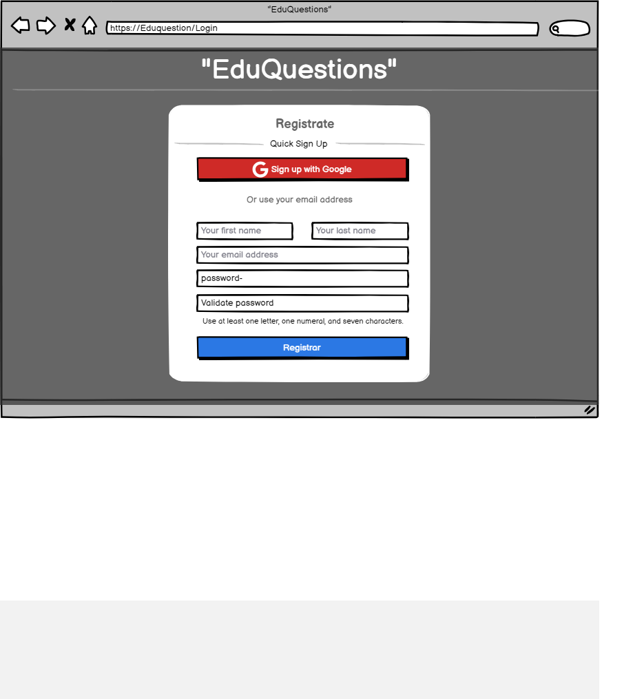

# Historia: Registro de estudiante.

- Yo como: Usuario estudiante
- Quiero: Poder registrarme de manera facil y sencilla. 
. Para: Poder recibir una guia de estudios.

## Analisis

### Pantalla de registro de usuario

A continuación se presenta la pantalla de registro, cuyo tendra dos funcionamientos los cuales son:

1. El usuario hizo clic previamente en registrar en el ingreso.
2. Cuando un usuario hace clic en "Registrarse con Google", se abrirá una ventana emergente que solicitará que inicien sesión en su cuenta de Google si aún no lo han hecho..
3. 



### Pantalla de subida de imagen

## Criterios de aceptacion

Gherkin

### Validacion de cantidad de imagenes

- Dado: Que el usuario inico sesión y desea crear una nueva subasta.
- Cuando: Este por guardar la subasta
- Entonces: El sistema debe validar que subio al menos 2 y máximo 4.

### Código de tarjeta no encontrado

## Disenio

### Pantalla de creacion de nueva subasta

1. Para buscar el coddigo de la carta:

Request:
```
GET BASE_URL/api/v1/cardInfo/{cardCode}
Accept: Application/json
Authorization: Bearer JWT
```

Response: Exitoso statusCode: 200
```
{


}
```

Response: No encontrado statusCode: 404
```

```


