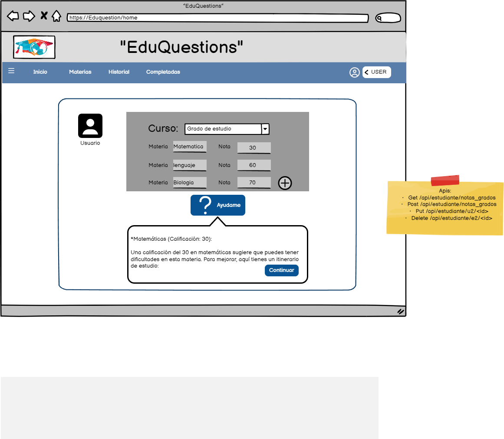

# Historia: Publicacion de Item.

- Yo como: Usuario estudiante
- Quiero: Registrar mis materias y establecer las notas. 
. Para: Poder tener una guia de estudios.

## Pendientes de definición.

1. ¿El numero de materias no deber ser ilimatado?
R. Juan Perez indica que en su experiencia 13 materias son lo normal.


## Especificación de requerimientos.

1. La cantidad maxima de materias 13.
2. Al momento de registrar las materias, se debe indicar al estudiante las cantidad maxima de materias.
3. Se deben enviar las materias con sus notas.

## Analisis

### Pantalla de Registro de notas y materias

A continuación se presenta la pantalla registro de grado y notas, cuyo funcionamiento es.

1. El usuario debera hacer click sobre el grado en el que este.
2. El usuario deberá tener lista de grados.
3. El usuario deberia tener que seleccionar el grado que se encuentre.
4. El usuario podra añadir las materias con la calificación



### Pantalla de subida de imagen


### Validacion de grado y notas
- Dado: Que el usuario inicio sesión y desea crear una guia de esteduio.
- Cuando: Este por hacer click en ayudame.
- Entonces: El sistema debe validar que subio al menos 4 materias con sus notas.


## Disenio

### Pantalla de registro de grado y notas

1. Para buscar el grado:

Request:
```
GET BASE_URL/api/estudiante/notas_grados
Accept: Application/json
Authorization: Bearer JWT
```

Response: Exitoso statusCode: 200
```
{


}
```

Response: No encontrado statusCode: 404
```

```


