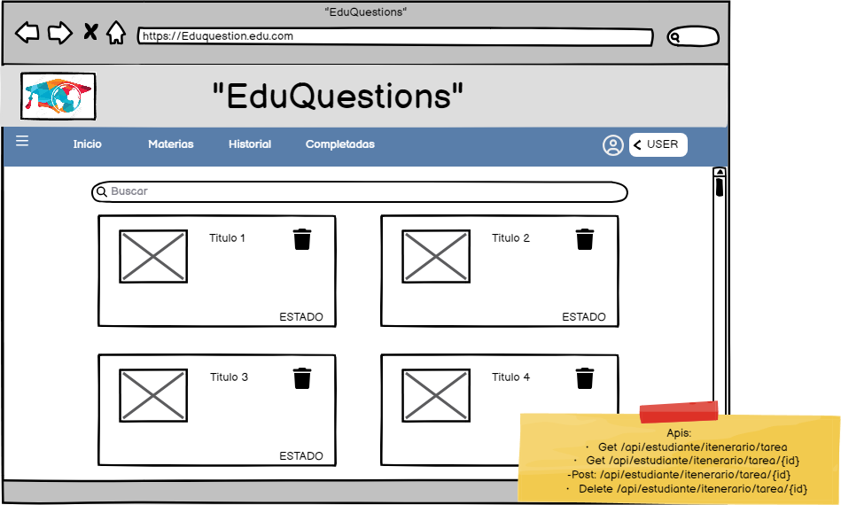

# Historia: Publicacion de Ingreso.

- Yo como: Usuario Estudiante
- Quiero: Acceso a la página de listado de notas de estudio.
. Para: poder ver una lista de mis propias notas de estudio, con el plan de estudio.

Yo, como Usuario Estudiante,
Quiero: poder ver la fecha de creación de cada nota de estudio en la lista,
Para: tener una referencia de cuándo se crearon las notas.

## Pendientes de definición.

1. ¿Cómo se organizarán y mostrarán las notas de estudio en la plataforma?
R: Se mostraran deacuerdo al grado de dificultad (se mostrara la nota mas baja para crear un plan de estudio)


## Especificación de requerimientos.

1. Los usuarios registrados en EduQuestion deben tener acceso a una sección o página donde puedan listar y ver sus propias notas de estudio.
2. Las notas de estudio deben estar organizadas de forma clara y ordenada, posiblemente con un título y una breve descripción para cada nota.
3. Los usuarios deben poder hacer clic en una nota de estudio para ver su contenido completo.
## Analisis

### Página de Listado de Notas de Estudio
La página de listado de notas de estudio en EduQuestion funcionará de la siguiente manera:

1. Los usuarios registrados podrán acceder a esta página desde su panel de control o menú principal.
2. Las notas de estudio se mostrarán en una lista, posiblemente en forma de tarjetas, con información básica como el título y la fecha de creación.
3. Al hacer clic en una nota de estudio, se mostrará su contenido completo, lo que permitirá a los usuarios estudiarla.



### Pantalla de subida de imagen

## CCriterios de aceptación (Gherkin)

### Listado de Notas de Estudio
- Dado: Un usuario registrado en EduQuestion.
- Cuando: Accede a la página de listado de notas de estudio.
- Entonces: Debe poder ver una lista de sus propias notas de estudio, con opciones para filtrar, ordenar y buscar.
### Código de Visualización de una Nota de Estudio

## Disenio

### Pantalla de listar notas de estudio

1. Para buscar la nota mas baja y realizar un plan de estudio:

Request:
```
GET BASE_URL/api/estudiante/notas_grados/temario/id
Accept: Application/json
```

Response: Exitoso statusCode: 200
```
{


}
```

Response: No encontrado statusCode: 404
```

```


