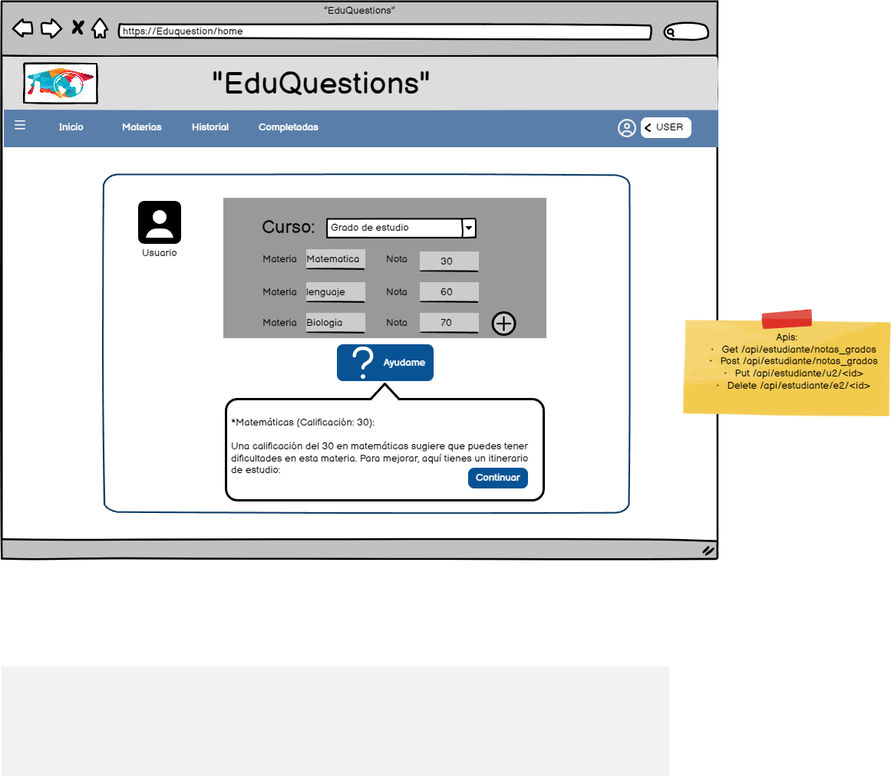

# Historia: Busqueda nota mas bajo de todo la lista para realizar un plan de estudio..

- Yo como: Usuario estudiante
- Quiero: Poder observar en que materia estoy mal
. Para: Poder recibir la ayuda.


## Especificación de requerimientos.

1. Se registro las notas correctamente.
2. Buscar la nota mas baja de las notas subidas.
4. Se deben mostrar un mensaje con las materia con promedio bajo.

## Analisis

### Pantalla de muestra de nota baja

A continuación se presenta la pantalla de nota baja, cuyo funcionamiento es.

1. El usuario hizo clic previamente en Ayudeme.
2. El usuario deberá tener lista de notas bajas



### Pantalla de nota baja

## Criterios de aceptacion

Gherkin

### Validacion de cantidad de imagenes

- Dado: Que el usuario registro materias y notas, desea recibir ayuda.
- Cuando: Este por guardar y continuar
- Entonces: El sistema debe seleccionar la materia con nota baja


### Pantalla de nota baja

1. Para buscar el coddigo de la carta:

Request:
```
GET BASE_URL/api/estudiante/notas_grados/{id}
Accept: Application/json
Authorization: Bearer JWT
```

Response: Exitoso statusCode: 200
```
{


}
```

Response: No encontrado statusCode: 404
```

```


