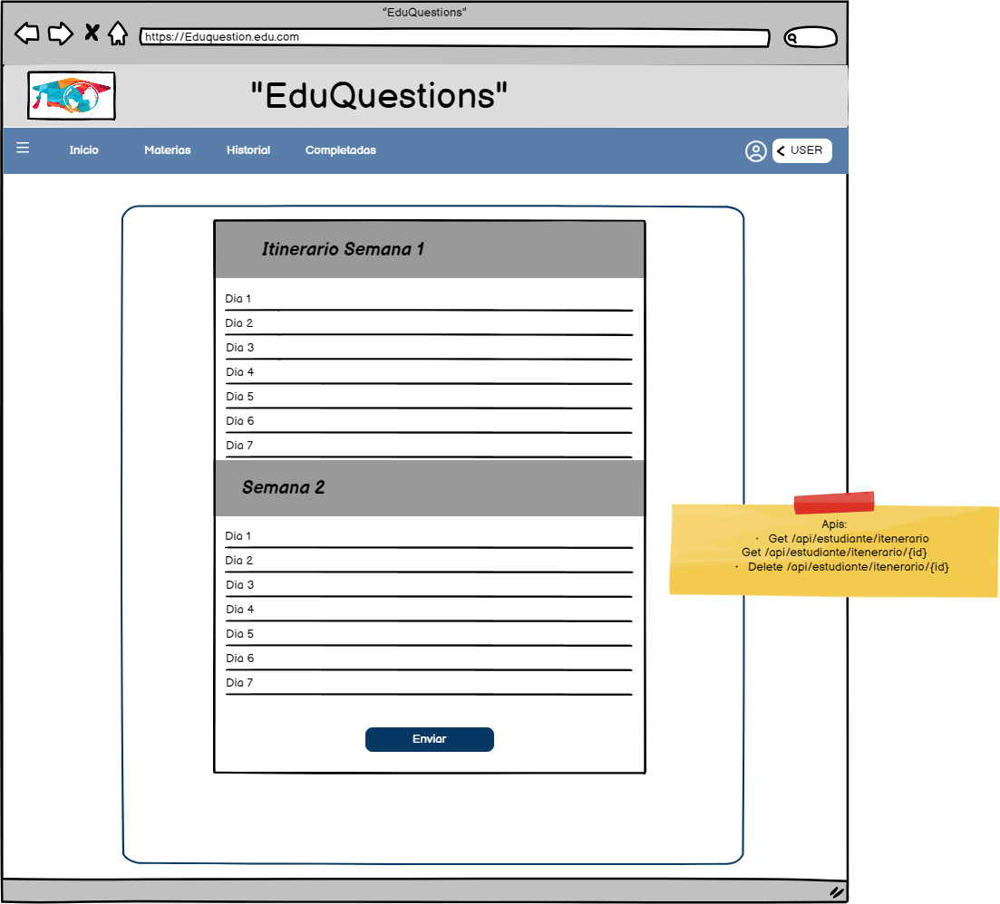

# Historia: Gestión el plan de estudios para el estudiante..

- Yo como: Usuario estudiante
- Quiero: Poder seguir las tareas que debo cumplir viendo los estados si complete o no.
. Para: Poder vender mis tarjetas.


## Especificación de requerimientos.

1. La cantidad maxima de tareas

## Analisis

### Pantalla de creacion de nueva subasta

A continuación se presenta la pantalla de subida, cuyo funcionamiento es.

1. El usuario hizo clic previamente en enviar.
2. El usuario deberá tener lista las tareas...



### Pantalla de subida de imagen

## Criterios de aceptacion

Gherkin


### Pantalla de creacion de nueva subasta

1. Para buscar el coddigo de la carta:

Request:
```
GET BASE_URL/api/v1/cardInfo/{cardCode}
Accept: Application/json
Authorization: Bearer JWT
```

Response: Exitoso statusCode: 200
```
{


}
```

Response: No encontrado statusCode: 404
```

```


